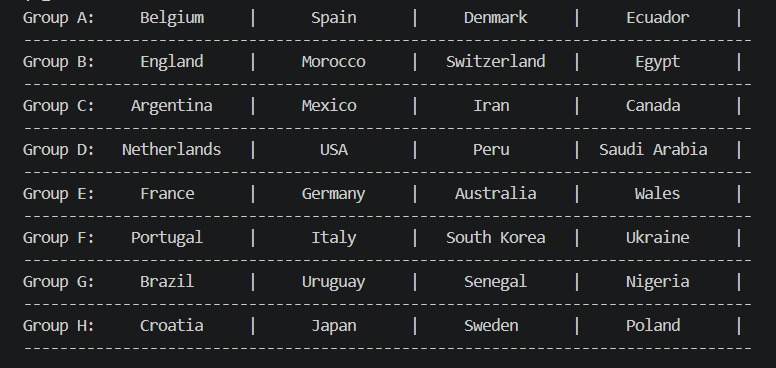
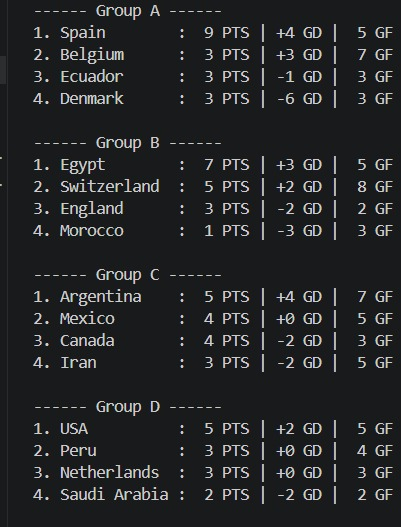
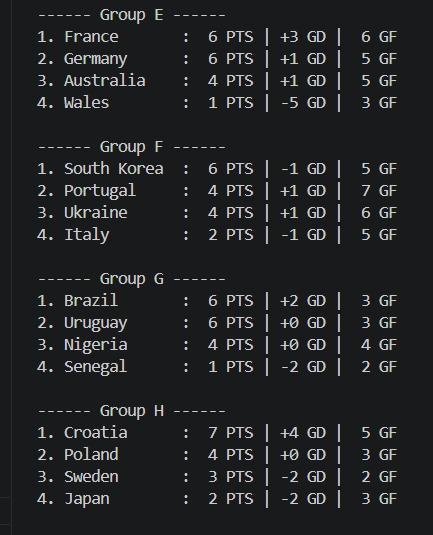
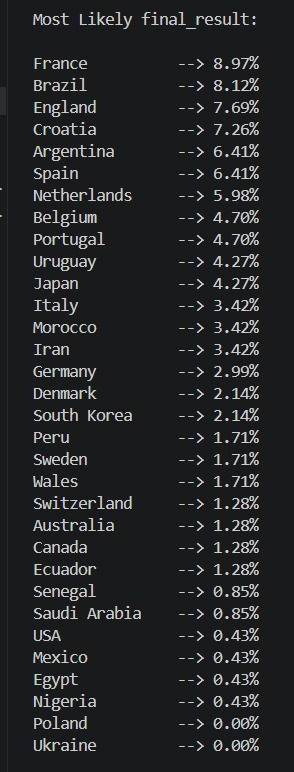
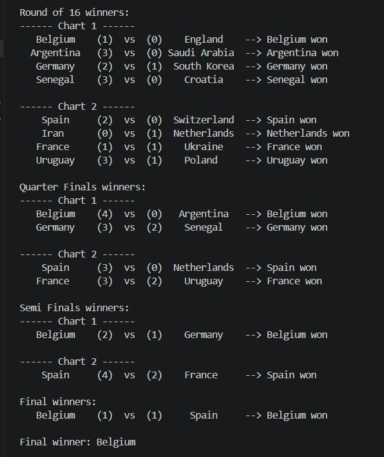

This project is an object-oriented World Cup 2026 simulator that reads team data from a CSV file, performs the group draw based on FIFA rankings, and simulates both the group and knockout stages. It runs the tournament many times to estimate each team’s championship probability and displays the knockout bracket in a text-based 
format.

---

